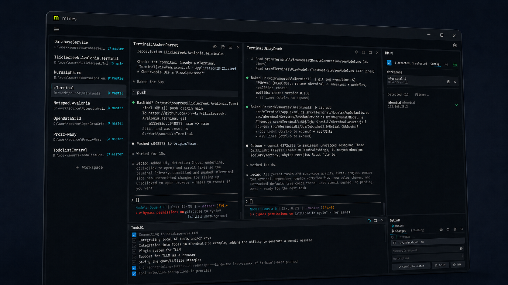

# mTiles

Terminal manager built for AI-assisted development. Workspaces, split tiles, database bridge for LLM agents, git — in one window.



## What makes it different

Unlike Warp, Wave, or WezTerm — mTiles doesn't try to be an AI itself. It manages the environment your AI tools run in.

**Database bridge for LLM agents** — lets Claude Code, OpenCode, or any agent query SQL Server / PostgreSQL directly via a local HTTP server. No credentials are ever exposed to the agent.

**SQL Guard** — write protection enabled by default. INSERT/UPDATE/DELETE require explicit per-database unlock. DROP/TRUNCATE/ALTER always blocked. If the agent attempts a write in read-only mode, a real-time confirmation dialog appears. Keyword scanning strips comments to prevent bypass.

**AI tool profiles** — named shell profiles tied to specific AI binaries (Claude Code, OpenCode, Codex, Pi Agent). Auto-detection of 18+ CLI tools, startup/fallback scripts, DirectLauncher with auto-restart. Profiles appear only when the tool is installed.

**ThemeBridge** — terminal ANSI palette drives the entire UI. Change the color theme and every surface updates — not just the terminal background. 17 themes (Catppuccin, Tokyo Night, Gruvbox, Rosé Pine, One Dark, Solarized, and more), dark and light.

**Git tile** — staging, diff (unified + side-by-side), commit with message suggestions, stash, push/fetch, tags, undo last commit, unpushed commit markers. No need for a separate Git GUI.

**Workspaces** — each workspace is a directory with its own tile layout, database config, and git branch display. Switch instantly — terminals stay alive (cached views, no respawn).

**Split tiles** — recursive binary tree. Split any tile horizontally or vertically, nest arbitrarily. Each tile can be a terminal, note, todo, git, or database.

## Running

```
git clone https://github.com/b-y-t-e/mTiles.git
cd mTiles
dotnet run --project src/mTiles
```

Requires [.NET 10 SDK](https://dotnet.microsoft.com/download).

## Tech

.NET 10, Avalonia 12, CommunityToolkit.Mvvm, Iciclecreek.Avalonia.Terminal (PTY), AvaloniaEdit.

## License

MIT
