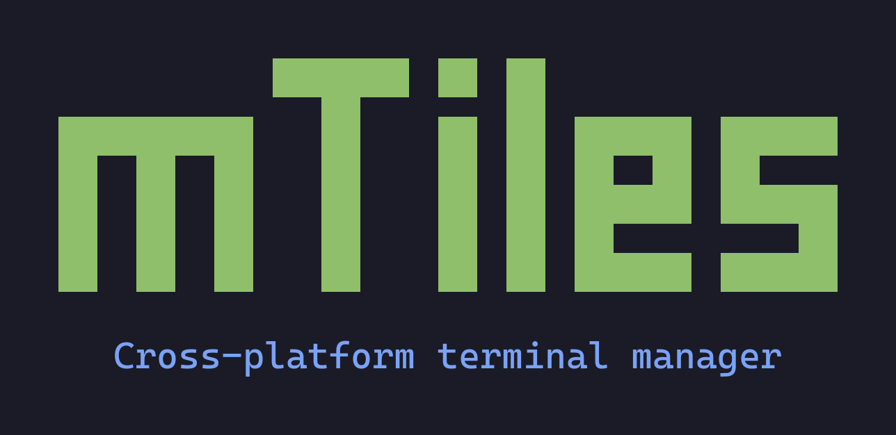
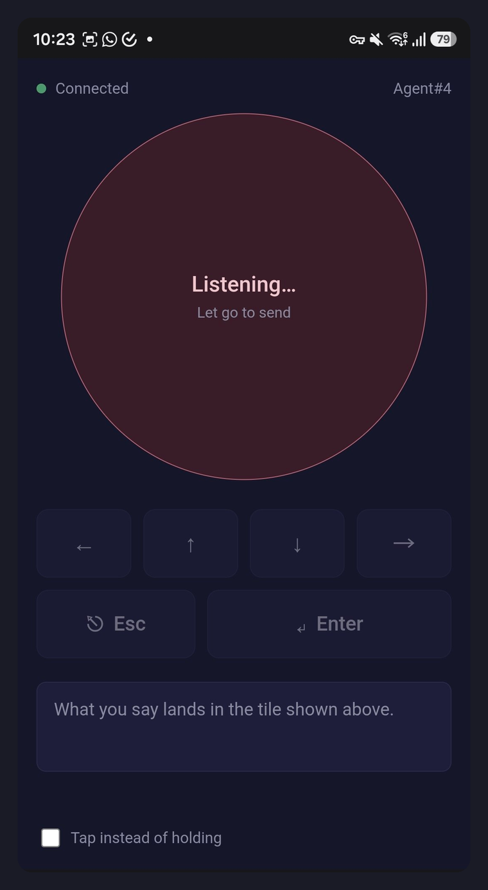

<p align="center">
  
</p>


# mTiles

**Close the window. Open it tomorrow. Your agents are still mid-conversation.**

mTiles is a terminal manager for people who spend the day working *with* AI coding agents. It does not
try to be one. It is the room they work in — five agents in split tiles, a database they can query
without ever seeing a password, and a phone in your pocket that types into whichever tile is in front
of you.


## What it does

**Reopen and carry on.** A tile’s id *is* the agent’s session id, so restarting mTiles drops you back
into the same conversation — not a fresh prompt. Claude Code and pi take an id outright; OpenCode
cannot be told one, so mTiles writes the document `opencode import` recreates the session from; Codex
and agy name their own and mTiles reads it back afterwards. Five CLIs, four different mechanisms, one
behaviour you can rely on.

**Five agents, and you pick which account each one runs as.** Claude Code, OpenCode, Codex, pi and
Antigravity (agy). You configure *instances* rather than tools — "Claude Code", or "Claude Code on GLM
5.3 via OpenRouter" — so the same CLI can run on a different provider, model and login in the tile next
door. Two subscriptions side by side is a supported setup, not a workaround.

**When the agent dies, the tile brings it back.** A launch chain watches the exit code *and* how long
the command ran, so a tool that crashed after two hours is restarted while one that fails in a second
falls through to the next command instead of looping. Rate-limited, so nothing spins.

**Describe a goal, not a prompt.** The Goal tile asks its clarifying questions, writes a plan and waits
for you to approve it, implements, then reviews its own work at four severities — blocker, error,
warning, suggestion — and loops until the criteria you set are met. Before it starts it photographs
your whole working tree, untracked files included, to a ref outside your history: nothing an agent does
in there is unrecoverable, and your `git log` never moves.

**Your databases, without handing over the password.** A local HTTP bridge lets any agent query SQL
Server and PostgreSQL, discovered on your machine or added by hand. The agent learns about it through a
generated skill file and never sees a credential. **SQL Guard** blocks writes by default — unlock
per database — and blocks `DROP`/`TRUNCATE`/`ALTER` always; a write against a read-only database raises
a dialog in front of you while the query waits.

**Talk to it, including from the sofa.** Speech recognition runs entirely on your machine — no account,
no upload — on Parakeet or whisper.cpp. Hold a key and dictate into the active tile. Or press the QR
button, scan it with your phone, and the phone becomes the microphone: which is what makes dictation
work over **Remote Desktop**, where the microphone is next to *you* and mTiles is on the far machine.

<p align="center">
  
</p>

That is the whole of what the phone gets — a page mTiles serves itself, no app to install. Hold the
circle and talk; let go and the text lands in the tile named in the corner, which is whichever tile is
active on the machine. **Enter, Escape and the four arrows** are there too, because dictating a command
is only half of driving an agent from across the room — the other half is the prompt it stops on.
Nothing destructive is reachable from the phone.

**What is left on your accounts.** The Usage tile reads every account this machine can actually ask —
Claude, Codex, Antigravity, OpenRouter — and shows how much of each window is gone, when it comes back,
and whether you are spending the week faster than the week is passing.

**The other tiles.** **Git** — staging, diff (unified and side-by-side), commit with message
suggestions from your own history, stash, push/fetch, tags, undo the last commit, unpushed markers.
**Note** — a markdown editor. **Todo** — a checklist. **Terminal** — PowerShell, Git Bash, bash, zsh or
fish. All of them saved with the workspace, and any tile can be turned into another kind where it
stands.

**Workspaces and split tiles.** Each workspace is a directory with its own layout, git branch and
database grants; switching is instant because the terminals are never killed. Split any tile either way
and nest as deep as you like — or press Ctrl+Shift+F and give one of them the whole window.

**One palette for everything.** The terminal’s ANSI colours drive the entire UI, so changing the theme
changes every surface rather than one rectangle. 17 themes — Catppuccin, Tokyo Night, Gruvbox, Rosé
Pine, One Dark, Solarized and more — dark and light.

## Running

```
git clone https://github.com/b-y-t-e/mTiles.git
cd mTiles
dotnet run --project src/mTiles
```

Requires [.NET 10 SDK](https://dotnet.microsoft.com/download).

### Linux (AppImage)

Releases ship a self-contained `mTiles-linux-x86_64.AppImage`. Two things it cannot bring with it:

**FUSE 2.** AppImages mount themselves through `libfuse.so.2`, and Arch-based systems — CachyOS, Omarchy
— ship only FUSE 3 by default. Without it the application does not start at all, and the error mentions
`libfuse.so.2` rather than mTiles. Either install it (`sudo pacman -S fuse2`) or skip the mount
entirely:

```
./mTiles-linux-x86_64.AppImage --appimage-extract-and-run
```

**A hole in the firewall, if you dictate from a phone.** mTiles opens one on Windows, with your consent;
on Linux it only tells you which command to run, because there is no desktop-wide elevation prompt worth
invoking and a GUI that shells out to `sudo` teaches the wrong habit. The phone panel names the firewall
it finds running (`ufw` or `firewalld`) and the command for that one. Distributions differ: Ubuntu leaves
`ufw` inactive, Fedora and CachyOS enable `firewalld`, Omarchy configures `ufw` to deny inbound, and
SteamOS runs neither.

Also worth knowing: Avalonia is an X11 application, so on Wayland desktops (Hyprland, KDE) it runs
through **XWayland**; and dictation needs ALSA (`libasound.so.2`, provided by `alsa-lib`/`pipewire-alsa`)
for the microphone — the phone bridge does not, since that audio arrives over the network.

## Tech

.NET 10, Avalonia 12, CommunityToolkit.Mvvm, AvaloniaEdit, and **Terminal.Avalonia** — our own terminal control (VT engine, ConPTY/forkpty, rendering), written for this app and published on NuGet.

## Roadmap

<details>
<summary>The things known to be missing or wrong, roughly in the order they bother us.</summary>

Not promises with dates — the things known to be missing or wrong, roughly in the order they bother us.

**Known limitations**

- **Restarting a shell can stall the UI** for as long as the child takes to die (up to ~2 s). The terminal control kills the old session on the UI thread; fixing it belongs in `Terminal.Avalonia`, not here.
- **Selection inside a full-screen TUI needs Shift held.** mc, vim and opencode grab the mouse, and the terminal control deliberately refuses a one-way override that would leave those apps unable to receive clicks. It is the xterm convention, but a habit to learn.
- **`cmd` is not offered as a shell.** It cannot run what an agent tile's launch chain is made of: it does not parse its command line by the rules the PTY backend quotes with, runs only the first line of a multi-line command, and does not treat `;` as a separator, so a chain of more than one command cannot work there. It used to be offered and then silently swapped for PowerShell behind your back, which meant a shell that was neither the one you picked nor the one running your commands. The shells are PowerShell, Git Bash, bash, zsh and fish; a settings file naming `CMD` falls back to the default.
- **Shell profiles and the AI Tools table are gone.** A profile was a name, a shell, a startup script, a fallback and the binary that had to be installed for it to appear — everything an AI CLI needed, written out by hand and kept working by hand. Those are now the agent's own business, so Settings has neither tab. Your existing tiles are migrated: a terminal running one of the four seeded AI profiles becomes an agent tile on the first launch of that workspace, and a copy of the layout as it was is kept beside it as `{id}.pre-agents.json`. A profile you wrote yourself is **not** migrated — it names no agent this application knows — and its tile comes back as a plain shell on the shell it was running, without the script. If that is a loss, the file above is the copy of what it was.
- **A shell nominated by path is gone.** The old Settings → General "custom shell" (path + arguments) has been removed: a shell is now one of the known kinds, because mTiles has to know how to quote for it, how to run a single command in it and how to unset a variable in it — none of which it can work out from a path to an arbitrary binary. If you had pointed it at nushell, a bash outside the usual places or a WSL wrapper, your terminals now start in the default shell instead, and the log (`%APPDATA%/mTiles/logs/`) says once what was dropped. The setting is not coming back in that form; a shell arriving as a class is. **The same applies to a default shell picked from a list**: on Linux and macOS that list used to hold whatever `$SHELL` pointed at, of any kind, so if yours was `nu`, `ksh` or `dash` it is no longer known either — your terminals start in the default shell and the log says once what was named. On Windows the same line covers `CMD`.
- **Text wins over images on paste.** When the clipboard holds both (a browser copy, a screenshot tool), Ctrl+V pastes the text and the agent never sees the image. Alt+V still hands it over.
- **Codex's session is worked out rather than told, and it can be wrong.** codex names its own conversation and never says what it chose, so mTiles finds the rollout file it left behind: the newest one started since this tile did, recording this tile's working directory, and not already held by another open tile. Two codex tiles started in the same second in the same workspace can still, in principle, take each other's — in which case one of them resumes the wrong conversation on the next launch. agy is asked outright and has no such ambiguity.
- **OpenCode's session file is an undocumented format.** Resume works by handing `opencode import` a small JSON document mTiles writes — opencode's own *export* format, not an API, measured against **1.18.14**. If a future opencode changes it, the import fails, the resume after it finds no session, and the tile falls through to a plain shell: history lost, tile intact. `OpenCodeSessionTests` is what turns that into a failing build rather than a surprise.

- **Dictating from a phone on a LAN means accepting a certificate warning once.** A browser hands out no microphone outside a secure context, and no public authority will ever certify `192.168.1.20`, so the bridge serves a certificate it signed itself and the phone objects the first time. Accept it and it is remembered — but only for the addresses that certificate names: joining a network this machine has not been on before forces a new certificate, and the phone asks again. mTiles carries the previous names forward, so the set converges and a network you have used before does not ask twice. The exception is **Tailscale**, whose MagicDNS name gets a real certificate — which is why it is the recommended path for remote work, and the only one that reaches a phone that is not on this machine's own network at all.
- **The phone bridge does not always get the port you configured.** On Windows the kernel reserves blocks of ports for Hyper-V, WSL and Docker at boot, and a port inside one can never be bound however free it looks — `netstat` blames PID 4, the kernel. The default 18091 landed inside such a block on the first machine it ran on. The bridge falls back to a free port and the panel says which; nothing you type depends on the number, because the QR code carries it.
- **The promise that audio never leaves the machine now has an exception you opt into.** Dictating from a phone means the audio crosses from your phone to your computer — encrypted, and to a device you own. Recognition still runs on the machine mTiles is on; nothing reaches a third party. Dictating from the local microphone is unchanged.

**Planned**

Two of these are worked out in detail in [`docs/ROADMAP.md`](docs/ROADMAP.md) — what is wrong now, what
the stopgap is, and what would settle it — so that picking one up does not begin by rediscovering why it
is there.

- **A model field that shows it has a list.** The agent instance form's Model and Fast model fields
  complete against the provider's own catalogue — hundreds of entries, matched by every typed word in
  any order — but `AutoCompleteBox` has no arrow and nothing to click, so a field with a full list
  behind it looks like an empty text box. `ComboBox IsEditable` has the arrow and cannot filter. What is
  wanted is one control that does both; the options, in cost order, are in the roadmap document.
- **A tile header that is an index, a kind and a description.** The tile's name is doing two jobs at
  once: the label somebody typed and the generated `Agent#1` nobody chose. The end state is three
  separate things — a position label assigned in reading order, the kind (already a glyph), and a
  description the user writes — with `Ctrl`+the label focusing that tile, on a shortcut that has to be
  configurable because `Ctrl+1` belongs to whatever is running inside the tile.
- **Collapsible workspace panel** — collapse to a narrow icon strip with workspace initials rather than hiding outright: click to switch, drag the splitter past its minimum to collapse. Reclaims the panel's width without losing quick switching.
- **Activity in the workspace panel** — the list on the left says nothing about what is happening inside a workspace you are not looking at, so a build finishing or an agent waiting for an answer goes unnoticed until you switch to it. The panel should show, per workspace, that its terminals are working: which ones are running something and which are sitting at an idle prompt. Open questions: what counts as "working" when the signal available is a live PTY rather than a process tree, and how it is shown — a dot, a count of busy tiles, or something that also distinguishes "needs you" from "busy".
- **Goal tile — the rest of the line.** Attachments are now done: a screenshot pasted into the composer with Ctrl+V (or Alt+V when the clipboard also holds text) is written beside the goal and handed to every prompt of the run as a path, with an `[Image #N]` marker left where the caret was. Everything else on this line is done too: the tile is drawn as a terminal transcript with phase colours from the ANSI palette; the review returns structured findings at four severities — blocker, error, warning, suggestion — rather than the substring `VERDICT: PASS`; when a goal is finished is set on the tile itself — tolerated errors and warnings (blockers never are), attempts, which of the SOLID principles apply, and whether the work has to leave the project building and its tests passing; the clarification round can be skipped when the goal is already clear and repeated while it is not; a goal can be worked out from the uncommitted changes instead of typed; a run that used up its attempts can be given more without losing the conversation; and each attempt starts a fresh tool process but is handed what the earlier ones changed and decided against.
- **A warning while you type, not after you send.** The Goal tile's composer takes two things that name something outside the text — `@` file mentions and `[Image #N]` markers — and both fail silently when they are left half-finished. Backspacing into `[Image #4]` leaves `[Image #4`, which stops being a marker: the picture is correctly dropped from the run, but nothing on screen says so, and the goal is sent describing an image the tool was never given. An `@` mention is looser still, because mTiles attaches nothing for it — the path is plain text in the prompt — so `@tests/mTiles.Tests/AssemblyIn` costs the run a tool call that finds nothing. The composer should say so before Send: a quiet line under the box naming what will not resolve, on a debounce so it does not flicker per keystroke, checking three things — that every `[Image #N]` is whole and has an image behind it, that every `@` path exists on disk, and that the brackets and quotes a mention needs are balanced. Open questions: whether it is a warning or a refusal (it must not be a refusal — a path can legitimately name a file the tool is about to create); whether the file check is worth a stat per mention on every pause in typing, or should reuse the mention source's own cached listing; and how it reads for a goal that deliberately mentions something that does not exist yet.
- **Favourite tiles.** Nothing marks the two or three tiles you actually live in, so finding them in a workspace that has grown means reading every header. Tiles should be markable as favourites and reachable directly — a short list, keyboard-first, ordered by the user rather than by the tree. Open questions: whether a favourite is scoped to its workspace or global, and what happens to one whose tile is closed — dropped silently, or kept as a way to reopen it.
- **Review tile.** Code review belongs beside the code, not in a browser: a tile that shows a diff — the working tree, a branch against another, or a pull request — and lets comments be written against lines and handed to an AI tool or pushed back to the forge. The Git tile already renders diffs and knows the repository, so the question is whether this is a second tile or a mode of that one, and how much of a pull request it can honestly show without becoming a GitHub client.
- **A first run with no agent installed should offer to install one.** The agent tile's chooser lists the agents that are actually on this machine, and on a fresh machine that list is empty — which is the correct answer and a useless screen. A short wizard at startup should name the agents mTiles knows, say which are installed, and offer to install one, running the install in a visible terminal tile rather than silently. Open questions: whether it appears once or whenever nothing is installed; how much it should promise on Linux and macOS, where each agent's installer differs; and whether an installation that needs elevation is offered at all or only described.
- **A CCS provider — Claude Code on a Codex subscription.** [CCS](https://github.com/kaitranntt/ccs) runs a local OAuth proxy that lets Claude Code work on a ChatGPT/Codex subscription with no API key. Today it can be wired by hand (an Anthropic provider pointed at `http://127.0.0.1:8317`, the proxy started yourself); the planned provider detects whether `ccs` is installed, offers to install it and to run its one-time Codex login — both in a visible terminal tile — and starts the proxy itself when a launch needs it. Only the Codex subscription is wired at first; more subscriptions (Gemini, Kimi, …) come later as a choice on the form. Details in [`docs/ROADMAP.md`](docs/ROADMAP.md).

</details>

## License

MIT
